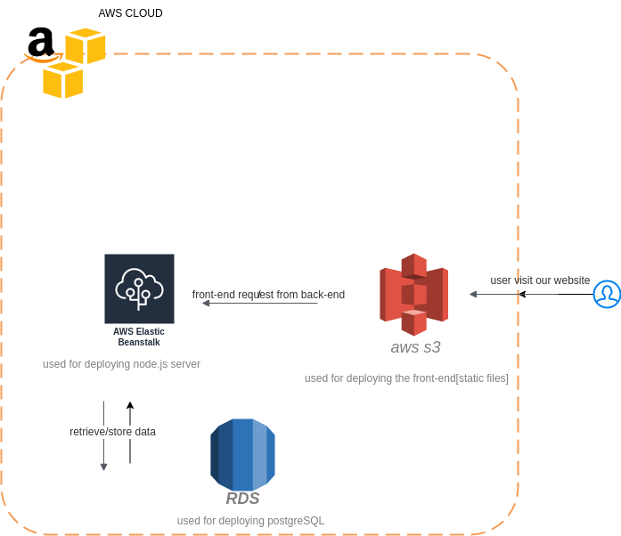

# [Hosting a Full-Stack Application](http://angularudagramui.s3-website-us-east-1.amazonaws.com/home)

## ***[App Link](http://angularudagramui.s3-website-us-east-1.amazonaws.com)*** 

i was free to choose deploy this starter app or deploy my own but i choose this one to challenge myself understanding codde i didin't write myself and how to dignose it to choose what cloud services it need.

## cloud infrastructure

**screenshot for RDS**

**screenshot for Elastic Beanstalk**

**screenshot for S3 Bucket for static hosting**

**screenshot for S3 Bucket for api media**

## CI/CD
using **CircleCI** to automate deploying process, check out the configuration [.circleci/config.yml](./.circleci/config.yml)

**pipeline overview**

**screenshot for Build pipeline**

**screenshot for manual deploy approval**

**screenshot for Deploy pipeline**

**screenshot for Environment variables in circleci**

## Set Env Run Book
- to add environment variable to **elastic beanstalk** `cd udagram/udagram-api` then use `eb setenv key=value key2=value` of course you must do this after creating the environment
### Installation

Provision the necessary AWS services needed for running the application:

1. In AWS, provision a publicly available RDS database running Postgres. 
1. In AWS, provision a s3 bucket for hosting the uploaded files. 
1. Export the ENV variables needed or use a package like [dotnev](https://www.npmjs.com/package/dotenv)/.
1. From the root of the repo, navigate udagram-api folder `cd starter/udagram-api` to install the node_modules `npm install`. After installation is done start the api in dev mode with `npm run dev`.
1. Without closing the terminal in step 1, navigate to the udagram-frontend `cd starter/udagram-frontend` to intall the node_modules `npm install`. After installation is done start the api in dev mode with `npm run start`.

## Testing

This project contains two different test suite: unit tests and End-To-End tests(e2e). Follow these steps to run the tests.

1. `cd starter/udagram-frontend`
1. `npm run test`
1. `npm run e2e`

There are no Unit test on the back-end

### Unit Tests:

Unit tests are using the Jasmine Framework.

### End to End Tests:

The e2e tests are using Protractor and Jasmine.

## Built With

- [Angular](https://angular.io/) - Single Page Application Framework
- [Node](https://nodejs.org) - Javascript Runtime
- [Express](https://expressjs.com/) - Javascript API Framework

## License

[License](LICENSE.txt)
